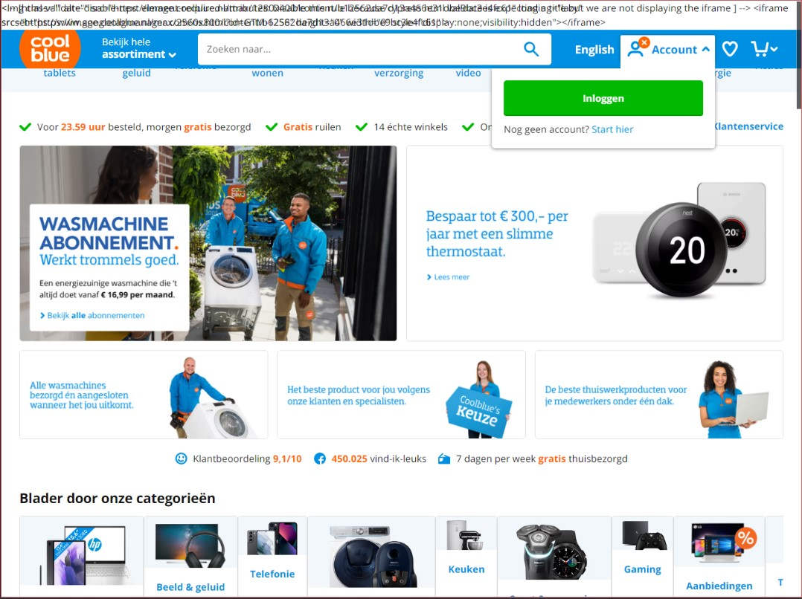

## Criteria

- Elke student onderzoekt 1 of twee features
- Zoek uit welke problemen de features kunnen veroorzaken (verzamel cijfers, meningen, ervaringen)
- Zoek uit hoe je dit kunt testen (hoe kun je een feature ‘uitzetten’)
- Vind een aantal sites waar dit ook problemen oplevert (uit je directe omgeving)
- Beschrijf hoe je dit kan fiksen

## Afbeeldingen
Mochten afbeeldingen niet geladen worden, dan kan dit invloed hebben op de gebruiksvriendelijkheid van je website. Veel afbeeldingen zijn niet alleen decoratief maar geven de gebruiker ook informatie.

Websites: PW2 portfolio en Coolblue

Chrome settings > privacy en beveiliging > afbeeldingen > niet toestaan

How to fix?
Alt text
SVGs gebruiken (indien mogelijk)

## Custom Fonts

## Kleur
*Welke problemen kan dit veroorzaken?*
8% van de mannen zijn kleurenblind en 2% van de vrouwen, samen dus 10% van de wereldbevolking. Wanneer je rekening houdt met kleuren en contrast in je design help je niet alleen deze mensen, maar je helpt bijvoorbeeld ook mensen met gezonde ogen die energiebesparing hebben aangezet op hun apparaat, of mensen die werken in een omgeving met veel of juist weinig licht. Als je geen rekening zou houden met contrast zou het kunnen zijn dat bepaalde mensen niet de content kunnen zien of lezen op je site.

Om bij het designen rekening te houden met kleur heeft WCAG minimumeisen opgesteld voor contrast ratios. Zo begint een goed contrast ratio vanaf 4.5:1 voor ‘normale’ tekst. Bij een contrast ratio van 1.0:1 is er helemaal geen contrast tussen kleuren, en bij 21.0:1 is het contrast maximaal. Contrast is niet alleen belangrijk voor tekst, maar je moet ook rekening houden met kleuren in tabellen of grafieken.

*Hoe je dit kunt testen?* 
Voor het testen van een bepaald contrast op je site/tussen twee kleuren, kun je gebruik maken van verschillende contrast checkers. Zo heb je bijvoorbeeld contrast-ratio.com en contrastchecker.com, en kan je dit bekijken via de dev tools in chrome.

*Vind een aantal sites waar dit ook problemen oplevert*

*Hoe kan je dit fiksen?*

*Bronnen*
https://aally.app/en/blog/test-the-accessibility-of-your-website-color-and-contrast/ 
https://css-tricks.com/accessibility-basics-testing-your-page-for-color-blindness/ 

## Muis/trackpad

## Breedband Internet

Website: Coolblue

Op slecht internet werkt de website redelijk oke. Het laad als eerste de bovenste navigatie bar, dan de content en dan de afbeeldingen. Wellicht beter dat de text content als eerste wordt geladen?

Website: Natuurhuisje

In eerste instantie kijkt de gebruiker naar een wit scherm. Het lijkt erop dat de website pas content toont wanneer zowel de HTML als de CSS is geladen. Daarna laat het de content zien met styling en grijze placeholder plaatjes en een fallback font. Terwijl de afbeeldingen worden geladen wordt ook het custom font ingeladen.

## Javascript

Website: Coolblue

Coolblue is deels functioneel zonder javascript. Wat vooral opvalt is dat sommige elementen raar overlappen en dat er boven aan de pagina een aantal errors staan over het niet kunnen laden van javascript. De website is wel functioneel, maar niet optimaal.

Website: Natuurhuisje

Bij natuurhuisje lijkt de website in eerste instantie geheel functioneel. Er is visueel weinig verschil tussen de website met en zonder javascript. Echter zijn er verschillende input velden en dropdowns die niet meer werken, dat is jammer want het is een hoofd functionaliteit van de website. verder zijn er ook een aantal image carousels die niet meer werken.

## Cookies
Cookies zijn bestanden die worden gemaakt door sites die je bezoekt. Ze verbeteren de online functionaliteit door browsegegevens op te slaan. Wanneer een gebruiker geen cookies accepteert, kunnen bepaalde functies niet meer werken zoals: inloggen en product toevoegen aan de winkelwagen.

Websites: Mediamarkt en DigiD

Chrome settings > privacy en beveiliging > Cookies en andere sitegegevens > alle cookies blokkeren

How to fix?
Zo min mogelijk afhankelijk van cookies
Melding weergeven (waarom cookies accepteren?)

### Localstorage

Local Storage is een API in webbrowsers waarmee webontwikkelaars gegevens kunnen opslaan in de browser van de gebruiker.

Voordelen:
Local Storage is een web API waarmee data lokaal opgeslagen kan worden in de browser van de gebruiker. Het is gemakkelijk te gebruiken, slaat gegevens snel op, heeft een grotere opslagcapaciteit dan cookies en de opgeslagen data vervalt niet tenzij de gebruiker deze zelf verwijdert.

    Eenvoudig te gebruiken: De API is eenvoudig te gebruiken en vereist geen complexe configuratie.

    Snelheid: De gegevens worden opgeslagen in de browser van de gebruiker, waardoor de toegangstijd tot de gegevens snel is.

    Capaciteit: De opslagcapaciteit is groter dan de cookies, wat betekent dat er meer gegevens kunnen worden opgeslagen.

    Geen vervaldatum: De gegevens die in de Local Storage worden opgeslagen, vervallen niet, tenzij de gebruiker de gegevens zelf verwijdert.

Nadelen:
Maar de Local Storage heeft kwetsbaarheden voor XSS-aanvallen, 
heeft geen automatische back-up, werkt niet in oudere browsers 
en heeft beperkte opslagcapaciteit vanwege afhankelijkheid van beschikbaar geheugen van de browser. 

    Veiligheid: Local Storage kan kwetsbaar zijn voor XSS (Cross-Site Scripting) aanvallen, waarbij kwaadwillende code toegang krijgt tot de gegevens die zijn opgeslagen in Local Storage.

    Geen server-side backup: Gegevens die zijn opgeslagen in Local Storage worden niet automatisch geback-upt, wat betekent dat gegevens verloren kunnen gaan als de browser van de gebruiker crasht of als de gebruiker zijn browsergeschiedenis verwijdert.

    Niet beschikbaar op oudere browsers: De API is niet beschikbaar op oudere browsers, wat betekent dat webontwikkelaars alternatieve oplossingen moeten gebruiken voor gebruikers die oudere browsers gebruiken.

    Opgebruikbare opslag: Local Storage is afhankelijk van het beschikbare geheugen in de browser van de gebruiker, wat betekent dat er een beperkte hoeveelheid gegevens kan worden opgeslagen voordat het geheugen van de browser opgebruikt is.

## Content / ad blockers

Ad blockers en content blockers zijn vrijwel het zelfde. Het verschil tussen de twee is dat ad blockers heel specifiek focussen op online advertenties, en ervoor zorgen dat ze niet op je webpagina verschijnen. Content blockers zijn algemener, je kunt hiermee dus verschillende type content blokkeren/ervoor zorgen dat ze niet worden geladen

Voor het testen van verschillende sites heb ik mijn standaard AdBlocker extensie gebruikt en een extra extensie geïnstalleerd genaamd uBlock Origin. Met behulp van de uBlock interface kon ik ervoor zorgen dat bijvoorbeeld media (afbeeldingen, video's audio) vanaf een bepaalde bestands grootte niet ingeladen werden. Daarnaast gaf het me de mogelijkheid om advertenties en externe scripts te blokkeren. Javascript zelf uitzetten kon niet, dat deed ik via mijn chrome inspector instellingen

Ad blocking software, and content blocking software, scannen domeinnamen van elementen die op een pagina worden geladen en vergelijken ze met een blacklist. Als een component geflagged is als 'ad', zorgt de ad blocker ervoor dat het script of materiaal niet meer wordt ingeladen.

Nadat alle content is ingeladen, kijkt de ad blocker naar elementen met bepaalde criteria, zoals afbeeldingen die een specifieke afmeting hebben en verwijderd deze. a